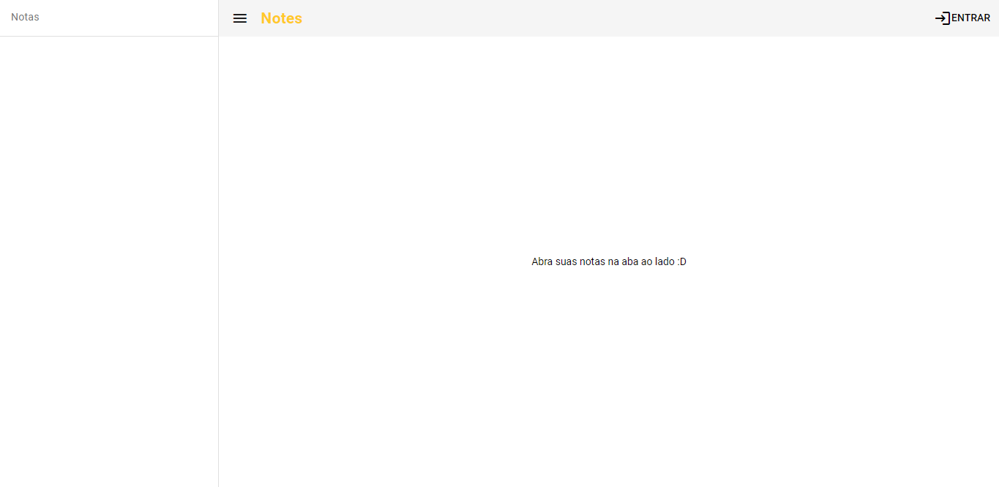
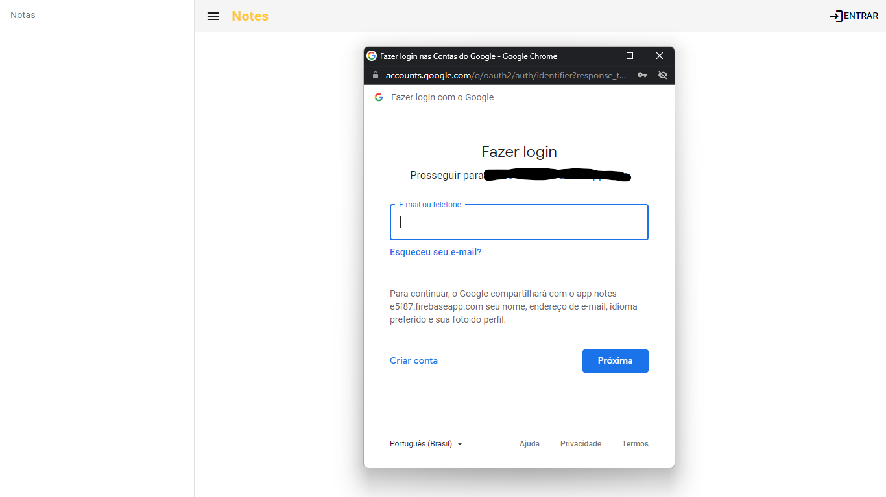
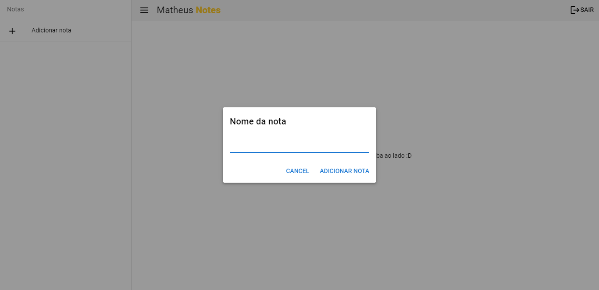
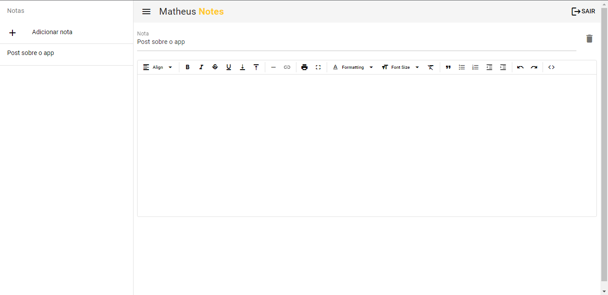

# Notes (notes)

A note app

App for manage notes cross platforms

Techs:

- Vue.JS 3
  - Composition API
  - Pinia
  - Vue Router
- Quasar

TO-DO:

- [x] Firebase
- [ ] Save as TXT | Salvar como TXT

|                   Tela inicial / Home screen                    |                   Login com Google / Login with Google                    |                    Primeira Nota / First Note                    |                      Página da Nota / Note page                       |
| :-------------------------------------------------------------: | :-----------------------------------------------------------------------: | :--------------------------------------------------------------: | :-------------------------------------------------------------------: |
|  |  |  |  |

## Install the dependencies

```bash
yarn
# or
npm install
```

### Start the app in development mode (hot-code reloading, error reporting, etc.)

```bash
quasar dev
```

### Build the app for production

```bash
quasar build
```

### Build the app for desktop mode (electron)

```bash
quasar build -m electron
```

### Customize the configuration

See [Configuring quasar.config.js](https://v2.quasar.dev/quasar-cli-vite/quasar-config-js).
